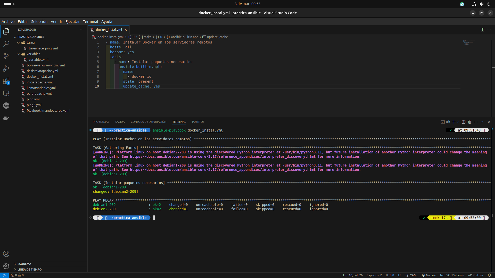
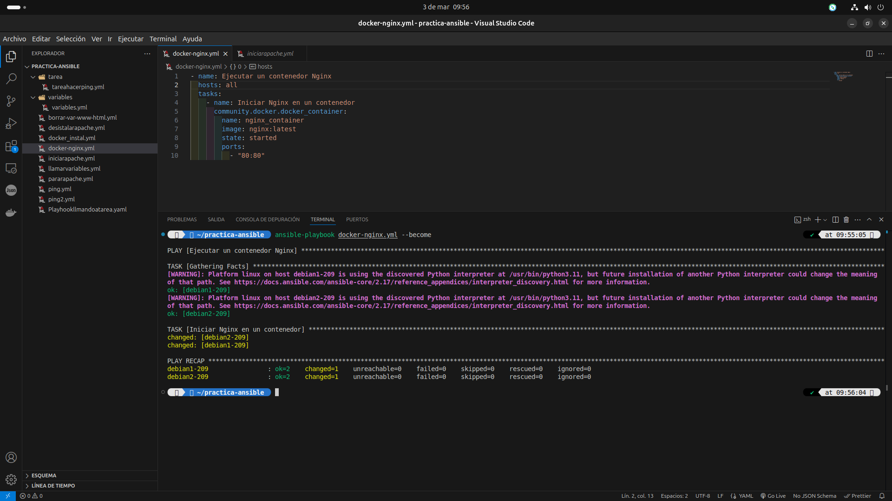
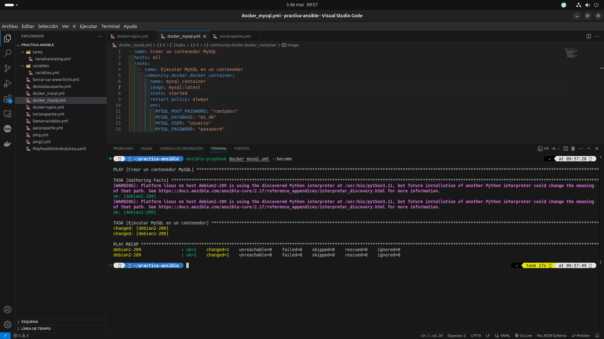
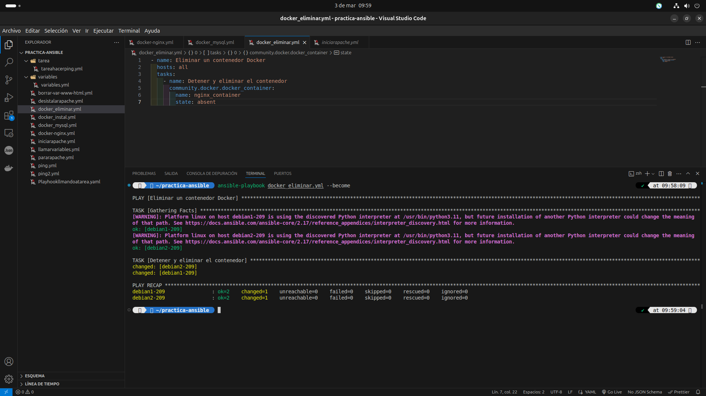

# Documentación del Módulo Docker en Ansible

## Introducción

El módulo `docker_container` en Ansible permite gestionar contenedores Docker en servidores remotos. Se utiliza para desplegar, administrar y eliminar contenedores de manera automatizada. Este módulo es ideal para la implementación de aplicaciones en entornos Docker sin necesidad de configurar manualmente cada contenedor.

## Instalación de Ansible y Docker

Antes de usar este módulo, es necesario instalar Ansible y Docker en el sistema de destino.

### Instalación de Ansible

```bash
sudo apt update
sudo apt install ansible -y
```

### Instalación de Docker en los servidores remotos

```yaml
- name: Instalar Docker en los servidores remotos
  hosts: all
  become: yes
  tasks:
    - name: Instalar paquetes necesarios
      ansible.builtin.apt:
        name:
          - docker.io
        state: present
        update_cache: yes
```



## Uso del Módulo `docker_container`

Este módulo permite crear y administrar contenedores Docker con las siguientes opciones principales:

| Opción           | Descripción                                            |
| ---------------- | ------------------------------------------------------ |
| `name`           | Nombre del contenedor                                  |
| `image`          | Imagen de Docker a utilizar                            |
| `state`          | Estado del contenedor (`started`, `stopped`, `absent`) |
| `ports`          | Puertos a mapear entre el host y el contenedor         |
| `env`            | Variables de entorno                                   |
| `restart_policy` | Política de reinicio del contenedor                    |

---

## Métodos de Uso

### 1️⃣ Ejecutar un Contenedor Nginx

```yaml
- name: Ejecutar un contenedor Nginx
  hosts: servidores
  tasks:
    - name: Iniciar Nginx en un contenedor
      community.docker.docker_container:
        name: nginx_container
        image: nginx:latest
        state: started
        ports:
          - "80:80"
```


✅ Este playbook despliega un servidor Nginx en un contenedor y expone el puerto 80.

---

### 2️⃣ Ejecutar un Contenedor MySQL con Variables de Entorno

```yaml
- name: Crear un contenedor MySQL
  hosts: servidores
  tasks:
    - name: Ejecutar MySQL en un contenedor
      community.docker.docker_container:
        name: mysql_container
        image: mysql:latest
        state: started
        restart_policy: always
        env:
          MYSQL_ROOT_PASSWORD: "rootpass"
          MYSQL_DATABASE: "mi_db"
          MYSQL_USER: "usuario"
          MYSQL_PASSWORD: "password"
```


🔹 Este playbook crea un contenedor MySQL y configura credenciales seguras.

---

### 3️⃣ Eliminar un Contenedor Docker

```yaml
- name: Eliminar un contenedor Docker
  hosts: servidores
  tasks:
    - name: Detener y eliminar el contenedor
      community.docker.docker_container:
        name: nginx_container
        state: absent
```


✅ Este playbook elimina el contenedor `nginx_container` si existe.

---

## Ejemplo Completo: Desplegar una Aplicación con Docker

```yaml
- name: Desplegar aplicación en contenedor
  hosts: servidores
  become: yes
  tasks:
    - name: Instalar Docker
      ansible.builtin.apt:
        name: docker.io
        state: present
        update_cache: yes
    
    - name: Iniciar la aplicación en Docker
      community.docker.docker_container:
        name: app_container
        image: myapp:latest
        state: started
        ports:
          - "5000:5000"

    - name: Verificar estado del contenedor
      ansible.builtin.command: "docker ps"
      register: docker_status
    
    - name: Mostrar estado del contenedor
      debug:
        var: docker_status.stdout_lines
```

✅ Este playbook instala Docker, inicia una aplicación y verifica su estado.

## Referencias

- [Documentación oficial del módulo ](https://docs.ansible.com/ansible/latest/collections/community/docker/docker_container_module.html)[`docker_container`](https://docs.ansible.com/ansible/latest/collections/community/docker/docker_container_module.html)
- [Repositorio GitHub de Ansible](https://github.com/ansible/ansible)

